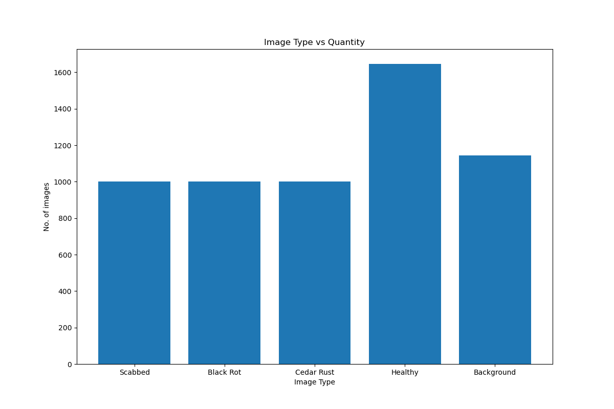
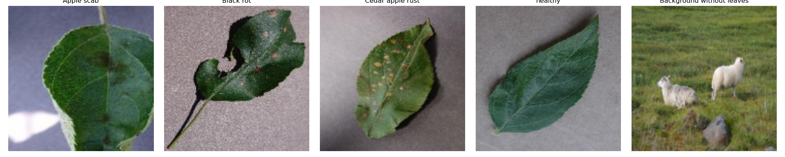

# Data Set Establishment Details

## Summary
This project uses a subset of the publicly available “Plant Leaf Disease” dataset from Geetharamani and Pandian (2019), focusing exclusively on apple leaf images. The apple portion of the dataset includes four classes—Apple_scab, Apple_black_rot, Apple_cedar_apple_rust, and Apple_healthy—representing both diseased and healthy specimens. Each image depicts a single apple leaf photographed under natural conditions, with variations in lighting, orientation, and background. Six augmentation techniques (flipping, gamma correction, noise injection, PCA color augmentation, rotation, and scaling) were applied by the authors to improve diversity and model robustness.
## Provenance
The apple leaf data were obtained from the full dataset hosted on Mendeley Data, Version 1, released on April 18, 2019, by J. Arun Pandian and G. Geetharamani. All images were collected, labeled, and preprocessed by the original authors; no additional data collection or augmentation was performed for this project beyond selecting the apple-related subsets.
## License
The data is made available under the Creative Commons CC0 1.0 Universal (Public Domain Dedication) license as specified on the Mendeley Data repository. This license places the dataset in the public domain, allowing unrestricted reuse, redistribution, and adaptation without the need for permission or attribution, though appropriate scholarly citation of the dataset and source publication is encouraged. 

---

## Data Dictionary
Each class folder contains color images (approx. 256×256 px) of single instances representing the labeled category. These images serve as input data for supervised image classification.

| Label / Class | Description |
| :--- | :--- |
| **Apple_scab** | Images of apple leaves infected with apple scab (*Venturia inaequalis*), typically showing olive-green or brown lesions on the leaf surface. |
| **Apple_black_rot** | Images of apple leaves showing symptoms of black rot (*Botryosphaeria obtusa*), characterized by circular brown lesions that darken and expand. |
| **Apple_cedar_apple_rust** | Images of apple leaves affected by cedar apple rust (*Gymnosporangium juniperi-virginianae*), displaying bright orange or yellow spots often surrounded by red halos. |
| **Apple_healthy** | Images of healthy apple leaves with no visible disease symptoms, serving as the control class. |
| **Background_without_leaves** | Images containing background scenes (e.g., soil, branches, sky, or other non-leaf objects) used to train the model to differentiate leaves from non-leaf areas. |

---

## Ethical Statement

This project uses only non-sensitive, publicly available images of apple leaves from an open dataset. No human or animal subjects are involved, and no personally identifiable or proprietary information is included. All data are used strictly for educational and research purposes in compliance with the dataset’s CC0 license and standard ethical research practices. Proper credit is given to the dataset creators and source publication, and results are reported transparently with acknowledgment of data scope and limitations.

---

## Question We Explored
**What does each class of apple look like, and what is the distribution of classes within our data?**  

---

## Exploratory Data Plots

---

## Unknown Question
**Are certain diseases more difficult to distinguish from healthy apples than others?**    
